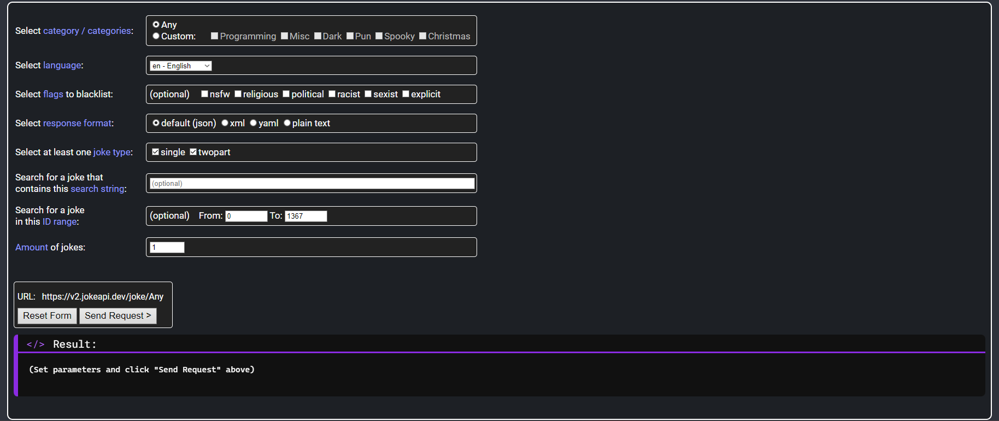

# SUIRE_JULES_TP_B2_API_JOKE
## Projet
Nous devons récupérer l'API Joke permettant de générer des blagues aléatoires avec un système de filtre pour éviter par exemple les blagues racistes, mysogines, sexuelles et nous devons les ranger dans un tableau par la suite.


__________________________________________________________________________________
Je joindrais quelques screenshots du projet ci-dessous.


## Mise à jour
Dernière mise à jour le ```07/10/2024```
